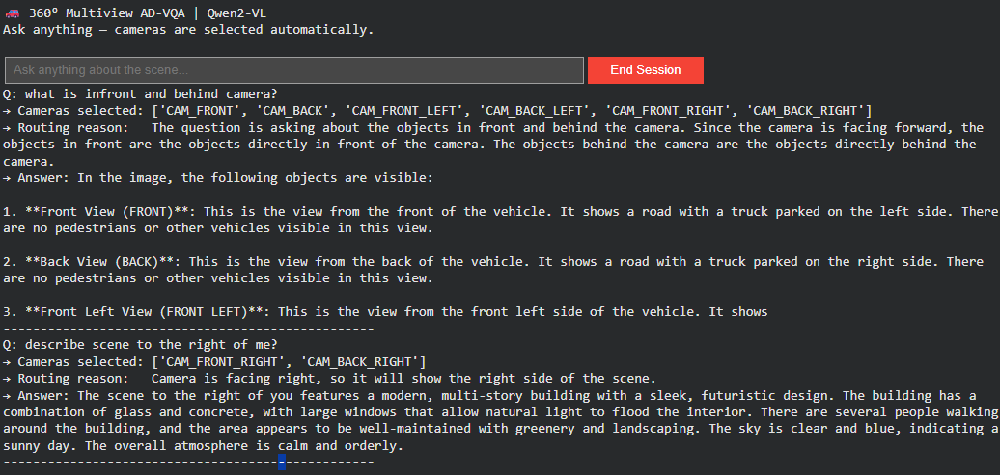
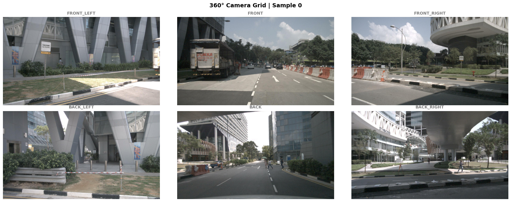

# Multimodal Drive Scene Understanding

This repository contains a notebook for visual question answering (VQA) on driving scenes from the nuScenes mini dataset using multimodal foundation models.

## Repository Contents

- `notebooks/Driving_VQA_v1.ipynb`: End-to-end notebook for loading nuScenes camera images and asking natural language questions about each scene.
- `results/examplemulticameraqa.png`: Example output from the multi-camera VQA flow.
- `results/nuscenesscen0.png`: nuScenes-style multi-camera scene layout (reference visualization).
- Colab notebook: [Open in Google Colab](https://colab.research.google.com/drive/1iLR6eBwKxxSYHYqR80B5xrW_zckrOIlo?usp=sharing)

## What the Notebook Covers

The notebook is organized into three parts:

1. **BLIP-2 pipeline** (`Salesforce/blip2-opt-2.7b`)
   - Uses `Blip2Processor` and `Blip2ForConditionalGeneration`
   - Single-image interactive Q&A and a multi-sample loop over nuScenes mini
   - Saves a figure grid to `blip2_vqa_results.png`

2. **Qwen2-VL pipeline** (`Qwen/Qwen2-VL-2B-Instruct`)
   - Uses `Qwen2VLForConditionalGeneration` and `AutoProcessor` with `qwen_vl_utils.process_vision_info`
   - Single-image VQA, test prompts, and an interactive question widget
   - Primarily uses `CAM_FRONT` for these cells

3. **Multi-camera VQA**
   - Loads all six ring cameras for one sample (`CAM_FRONT`, `CAM_FRONT_LEFT`, `CAM_FRONT_RIGHT`, `CAM_BACK`, `CAM_BACK_LEFT`, `CAM_BACK_RIGHT`)
   - **Query analyzer**: a text-only Qwen2-VL step reads the user question and returns a JSON list of which cameras are relevant (with fallbacks if parsing fails)
   - VQA is then grounded on the selected views instead of an arbitrarily selected camera, enabling it to choose which camera(s) to use for answering questions and describe the driving scenario

Example (multi-camera routing and answers):

## Environment and Dependencies

The notebook is designed for **Google Colab** with GPU (recommended: T4) and installs packages in cells, including:

- `transformers`
- `accelerate`
- `nuscenes-devkit`
- `qwen-vl-utils`
- `Pillow`
- `matplotlib`
- `ipywidgets`

## Dataset Setup

The notebook expects nuScenes data under a mounted Google Drive path:

- `NUSCENES_ROOT = /content/drive/MyDrive/nuscenes/nuscenes_dataset`

Expected folders include:

- `maps`
- `samples`
- `sweeps`
- `v1.0-mini`

Update `NUSCENES_ROOT` in the notebook if your dataset path is different.

## Quick Start

1. Open `notebooks/Driving_VQA_v1.ipynb` in Google Colab.
2. Enable GPU runtime (`Runtime -> Change runtime type -> T4 GPU`).
3. Run cells in order:
   - Install dependencies
   - Mount Google Drive
   - Verify nuScenes mini structure
   - Load model and processor
   - Run VQA on `CAM_FRONT` samples
4. Use interactive text widgets to ask scene questions (for example, traffic conditions, lane state, and nearby objects).
5. For multi-camera flow, run the **Multi Camera VQA** cells so the router can pick views (e.g. left lane change vs. weather) before answering.

## Notes

- The notebook uses `float16` inference and auto-detects CUDA when available.
- Model downloads are large and may take a few minutes on first run.